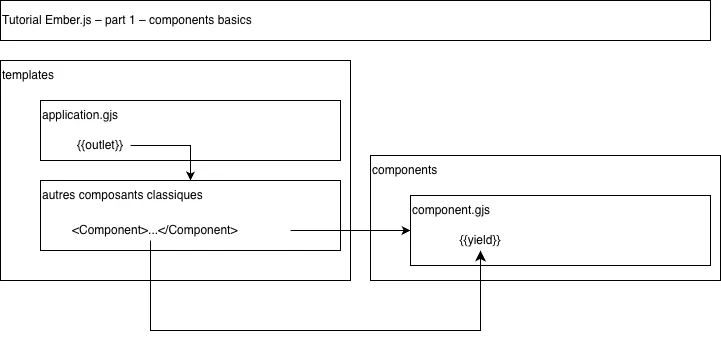
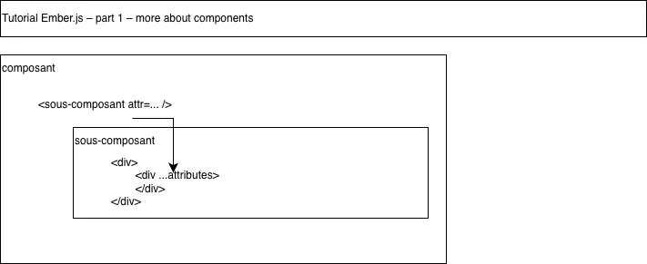

# learn_ember-js

following official tutorial on https://guides.emberjs.com/release/tutorial/

## Initialisation of the Ember project in a sub-directory

_Needs `ember-cli` installed._

```bash
ember new learn_ember-js --lang fr --strict --skip-git
```

## Start the project in development mode

```bash
cd ./learn_ember-js
npm start
```

Development server is accessible at: `localhost:4200`

## Reading notes

### Part 1 – Component Basics



### Part 1 – More about components



### Part 1 – Interactive components

On peut wrapper nos composants dans une classe JS:

```js
import Component from '@glimmer/component';

export default class ImageComponent extends Component {
  constructor(...args) {
    super(...args);
    this.isLarge = false;
  }

  <template></template>
}
```

qui peut s'écrire de manière concise:

```js
import Component from '@glimmer/component';

export default class ImageComponent extends Component {
  isLarge = false;

  <template></template>
}
```

que l'on peut passer en valeur de `state` avec `@tracked` et ajouter une `method` avec `@action`:

```js
export default class ImageComponent extends Component {
  @tracked isLarge = false;

  @action toggleSize() {
    this.isLarge = !this.isLarge;
  }

  <template></template>
}
```

> Lorsqu'une `@tracked` change, Ember re-rend tous les `templates` qui en dépendent.

**Syntaxe** du `if/else` et du `if` _inline_:

```js
<template>
      <button type="button" class="image {{if this.isLarge "large"}}" {{on "click" this.toggleSize}}>
        
        {{#if this.isLarge}}
          <small>View Smaller</small>
        {{else}}
          <small>View Larger</small>
        {{/if}}
      </button>
  </template>
```

**Syntaxe** qui existe aussi en ternaire:

```js
<small>View {{if this.isLarge "Smaller" "Larger"}}</small>
```

### Part 1 – Reusable components

> **L'ordre des attributs est important**

```html

```

> dans notre cas ci-dessus, le fait de placer le `alt` avant le `...attributes` permet à `...attributes` d'override `alt`. Cela n'aurait pas été possible dans l'autre cas.

### Part 2 – Routing

| Fichier | Rôle principal | Données manipulées |
| ------ | --------------- | ----------------- |
| router.js | Déclaration des URLs et des paramètres (:id). | URLs & noms de routes |
| routes/*.js | Récupération des données via model(). | params -> retourne model |
| templates/*.gjs | Réception de @model et transmission aux composants. | Contient {{outlet}} et @model |
| components/*.gjs | Rendu HTML, style et interactions utilisateur. | Reçoit ses arguments (ex: @app) |

### Part 2 – Ember Data

_Là, je vais en prendre de la note..._

La donnée est représentée par des objets-modèles. Nos modèles changent de forme.

On passe de:

```js
// /app/routes/index.js
import Route from '@ember/routing/route';

const APPLICATION_CATEGORIES = ['Music', 'Video', 'Games'];

function toFrench(category) {
  switch (category) {
    case 'Music':
      return '🎵 Musique';
    case 'Video':
      return '🎬 Vidéo';
    case 'Games':
      return '👾 Jeux';
    default:
      return category;
  }
}

export default class IndexRoute extends Route {
  async model() {
    let response = await fetch('/api/applications.json');
    let { data } = await response.json();

    return data.map((model) => {
      let { id, attributes } = model;
      let type;

      if (APPLICATION_CATEGORIES.includes(attributes.category)) {
        type = toFrench(attributes.category);
      }

      return {id, type, ...attributes};
    });
  }
}
```

à

```js
// /app/models/application.js
import Model, { attr } from '@warp-drive/legacy/model';

const APPLICATION_CATEGORIES = ['Music', 'Video', 'Games'];

export default class ApplicationModel extends Model {
  @attr title;
  @attr overproduction;
  @attr offline;
  @attr location;
  @attr category;
  @attr image;
  @attr ownership;
  @attr description;

  get type() {
    switch (this.category) {
      case 'Music':
        return '🎵 Musique';
      case 'Video':
        return '🎬 Vidéo';
      case 'Games':
        return '👾 Jeux';
      default:
        return this.category;
    }
  }
}
```

La classe `ApplicationModel` hérite de `Model`. En récupérant la donnée de notre serveur, chaque occurrence d'application sera représentée par une instance (aussi appelée _record_) de notre classe `ApplicationModel`.

> En plus des attributs que nous avons déclarés et qui doivent nous être retournés du back, **il y a toujours un attribut implicite `id`, qui est unique**.

On profite de ce changement pour transformer notre logique pour obtenir le `type` en un simple getter (dans l'exemple du tuto, on mappait sur les éléments du modèle pour lui ajouter un type) – et maintenant, on ajoute un seul getter. Les éléments en `@attr` deviennent _auto-tracked_.

> It is worth pointing out that EmberData provides a store service, also known as the EmberData store. In our test, we used the this.owner.lookup('service:store') API to get access to the EmberData store. The store provides a createRecord method to instantiate our model object for us. 

Puis, on branche notre modèle à la `Route`:

```js
import Route from '@ember/routing/route';
import { service } from '@ember/service';
import { query } from '@warp-drive/utilities/json-api';

export default class IndexRoute extends Route {
  @service store;

  async model() {
    const { content } = await this.store.request(query('application'));
    return content.data;
  }
}
```

Paramétrage de Ember Data pour savoir comment récupérer la donnée. Dans notre cas:

- Our resource URLs have an extra /api namespace prefix.
- Our resource URLs have a .json extension at the end.

On ajoute un namespace `api` dans `/app/app.js`.

Et on configure un `JsonSuffixHandler` dans `/app/services/store.js`.

> Euh... c'était succinct. Ils invitent à en voir davantage [ici](https://guides.emberjs.com/release/models/), notamment ce concernant les `relationships` qui m'intéressait particulièrement.
